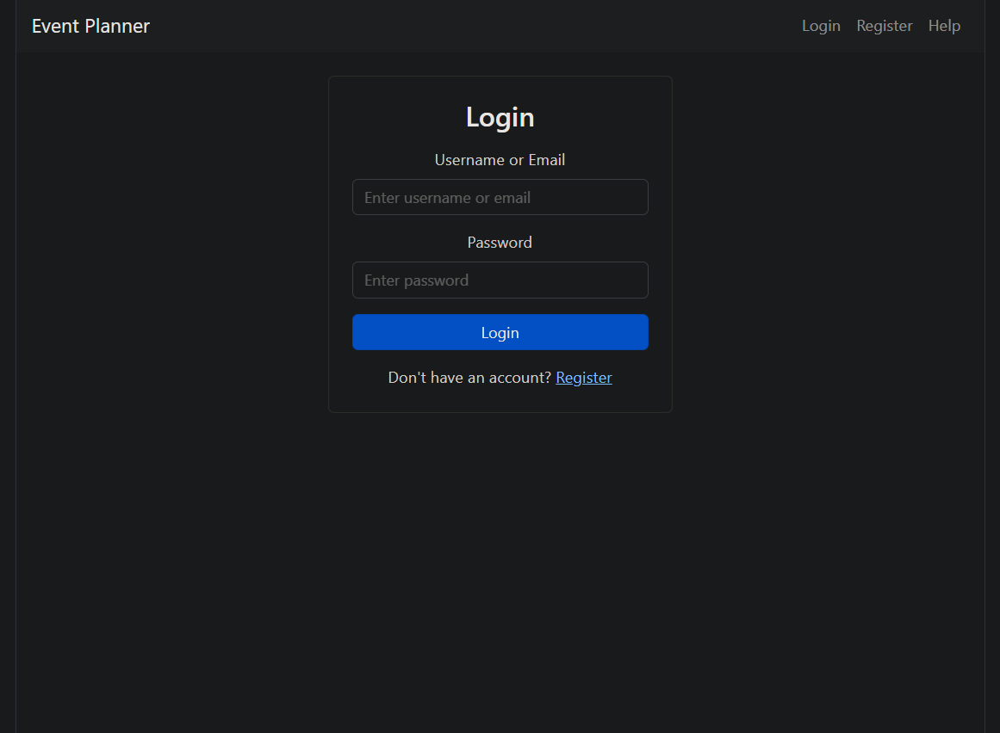
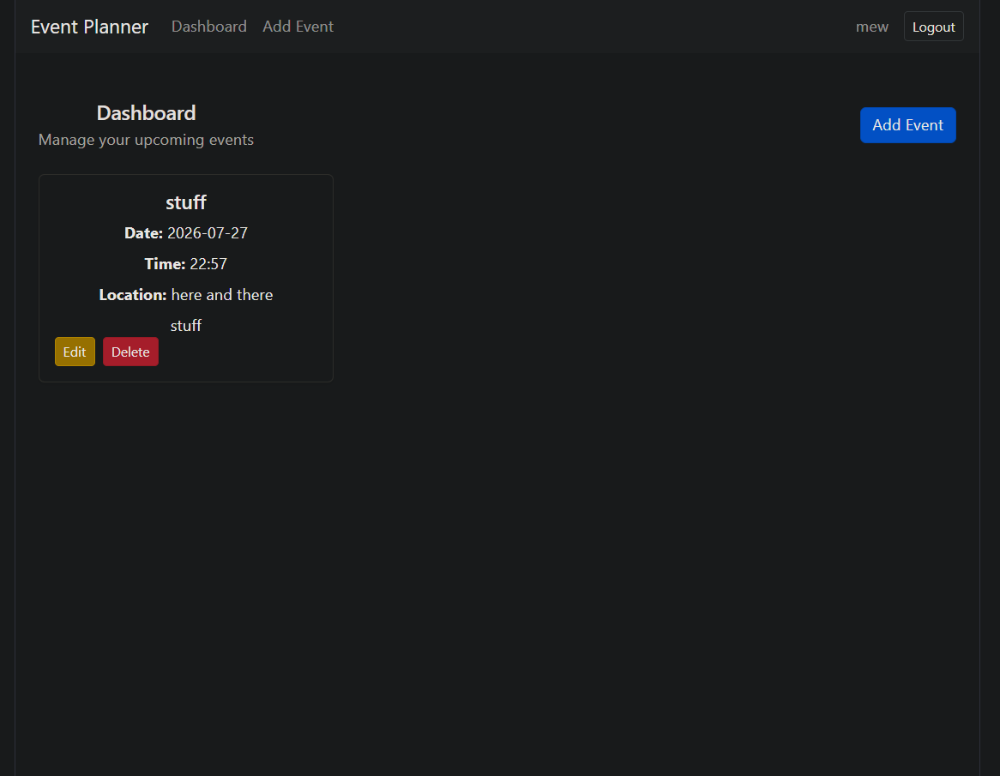
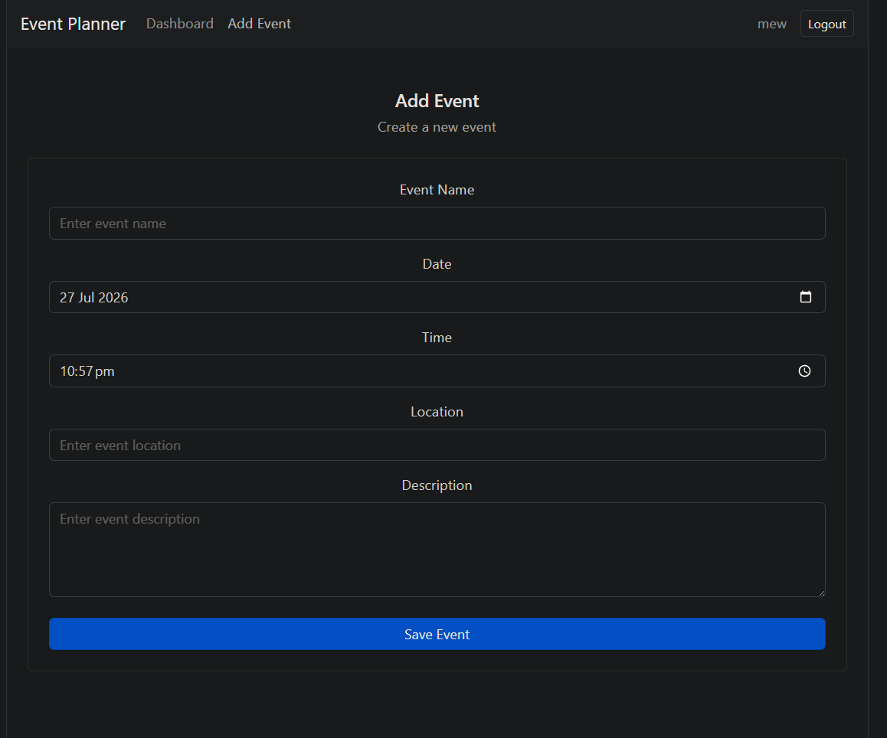

# Personal Event Planner

A React + Vite web application for creating, managing, and tracking personal or professional events such as meetings, appointments, and social activities. This project demonstrates a full user authentication flow, CRUD operations on event data, and state management using React's Context API.

## Screenshots

<table>
  <tr>
    <td></td>
    <td></td>
    <td></td>
  </tr>
</table>

## Features

- User registration and login system
- Create, edit, and delete events
- Dashboard to view all upcoming events
- Event validation
- Persistent data using localStorage
- Help page with usage instructions
- Responsive design using Bootstrap

## Tech Stack

React, Vite, Context API, Bootstrap

## Installation

1. Clone the repository

   ```bash
   git clone https://github.com/SZStanton/Event-Planner
   ```

2. Navigate into the project folder

3. Install dependencies

   ```bash
   npm install
   ```

4. Run the app

   ```bash
   npm run dev
   ```

5. Open the app in your browser

   ```bash
   http://localhost:5173/
   ```

## Future Improvements

- Move data storage from localStorage to a real backend/database
- Event reminders/notifications
- Calendar view alongside the dashboard list
- Recurring events
